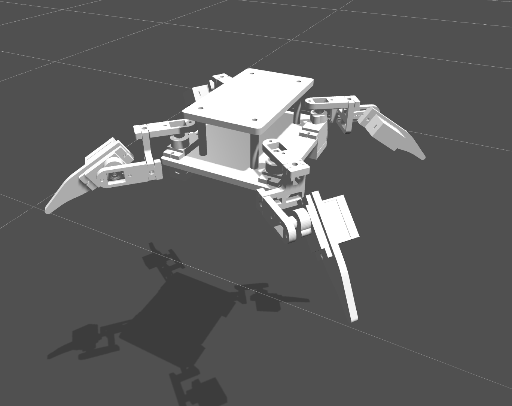
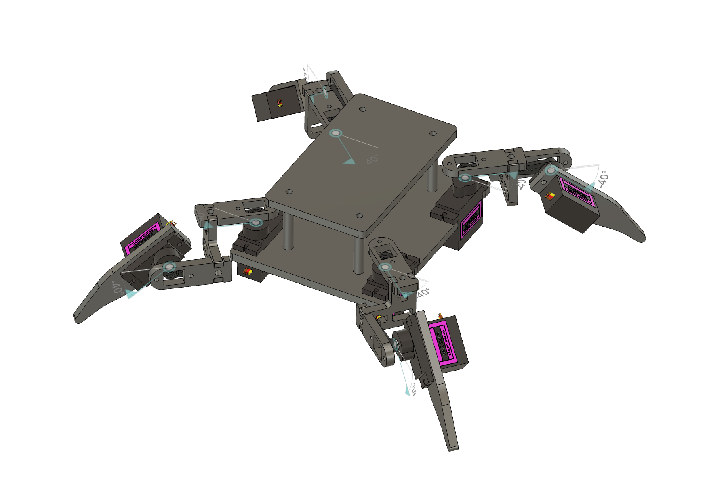

# AceBott-Spider-3D
3D Model STP + URDF from AceBott Spider

Ich habe den AceBott Spider in CAD nachgebaut.

Verfügbar als STP und URDF für Physikumgebungen wie Gazebo oder PyBullet.

URDF-Modell

STEP-Modell

